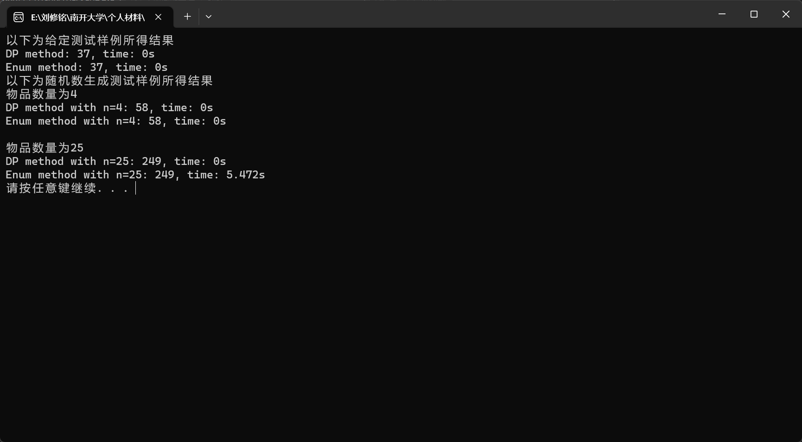

# 
**程序报告**

### 
学号：2112492&emsp;&emsp;&emsp;&emsp;&emsp;&emsp;姓名：刘修铭

## 一、时间对比

由运行截图可知，当数据量较小时，两种方法相差无几，但当数据量较大时，两种方法所消耗时间差距会急剧加大。

## 二、分析
可以看到，DP方法在两种情况下的时间复杂度都是 $O(nV)$，相对于枚举法的时间复杂度 $O(2^n)$ 要快得多，且随着物品数量的增加，DP方法的优势越来越明显。